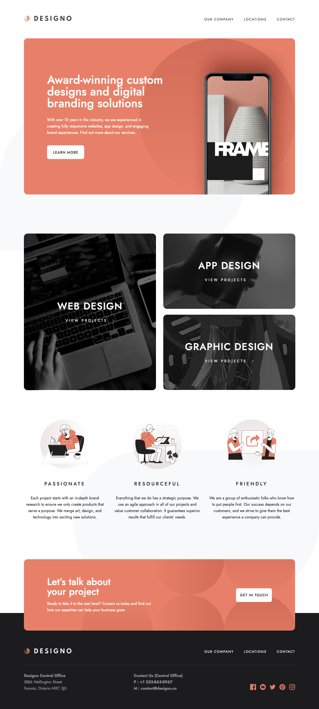

# Frontend Mentor - Designo agency website solution

This is a solution to the [Designo agency website challenge on Frontend Mentor](https://www.frontendmentor.io/challenges/designo-multipage-website-G48K6rfUT). Frontend Mentor challenges help you improve your coding skills by building realistic projects. 

## Table of contents

- [Overview](#overview)
  - [The challenge](#the-challenge)
  - [Screenshot](#screenshot)
  - [Links](#links)
- [My process](#my-process)
  - [Built with](#built-with)
  - [What I learned](#what-i-learned)
  - [Useful resources](#useful-resources)
- [Author](#author)

## Overview

### The challenge

Users should be able to:

- View the optimal layout for each page depending on their device's screen size
- See hover states for all interactive elements throughout the site
- Receive an error message when the contact form is submitted or when a field is left if:
  - The `Name`, `Email Address` or `Your Message` fields are empty should show "Can't be empty"
  - The `Email Address` is not formatted correctly should show "Invalid email format"

### Screenshot

### Links

<!-- - Solution URL: [Add solution URL here](https://your-solution-url.com) -->
- Live Site URL: [designo-matthiassmith.vercel.app](https://designo-matthiassmith.vercel.app)

## My process

### Built with

- Semantic HTML5 markup
- CSS Grid
- Mobile-first workflow
- [React](https://reactjs.org/) - JS library
- [Next.js](https://nextjs.org/) - React framework
- [TypeScript](https://www.typescriptlang.org/) - Static type definitions
- [Styled Components](https://styled-components.com/) - For styles
- [ScrollMagic](https://scrollmagic.io) & [react-scrollmagic](https://www.npmjs.com/package/react-scrollmagic) - For triggering animations when the user scrolls
- prefers-reduced-motion media query - to set reduced motion animations

### What I learned

Using Next.js works really well for building out multi-page sites with static assets. The `Image` component in particular comes in handy.

However, in projects where you are provided multiple images for different screen sizes already, the `Image` component can be cumbersome to use, because it's built to auto-magically size/resize single images. Being able to provide multiple sources for different screen sizes while still benefiting from the optimizations that the Next.js `Image` component provides would be nice to have.

To do this, I added my own component `ResponsiveImage` that dynamically sets the `src` and other attributes of the `Image` component based on the screen's size, the images given to it, and their properties.

### Useful resources

- [Wave's Web Accessibility Evaluation Tool](https://wave.webaim.org/) - This helped me to test my site's accessibility by giving me insights and errors related to accessibility concerns.
- [Solution for resize event with react hooks](https://dev.to/vitaliemaldur/resize-event-listener-using-react-hooks-1k0c) - This article and its code helped me to create a custom hook that gets and updates the screen's width upon window resize events.

## Author

- Website - [My Portfolio](https://portfolio-matthiassmith.vercel.app)
- Frontend Mentor - [@MatthiasSmith](https://www.frontendmentor.io/profile/MatthiasSmith)
